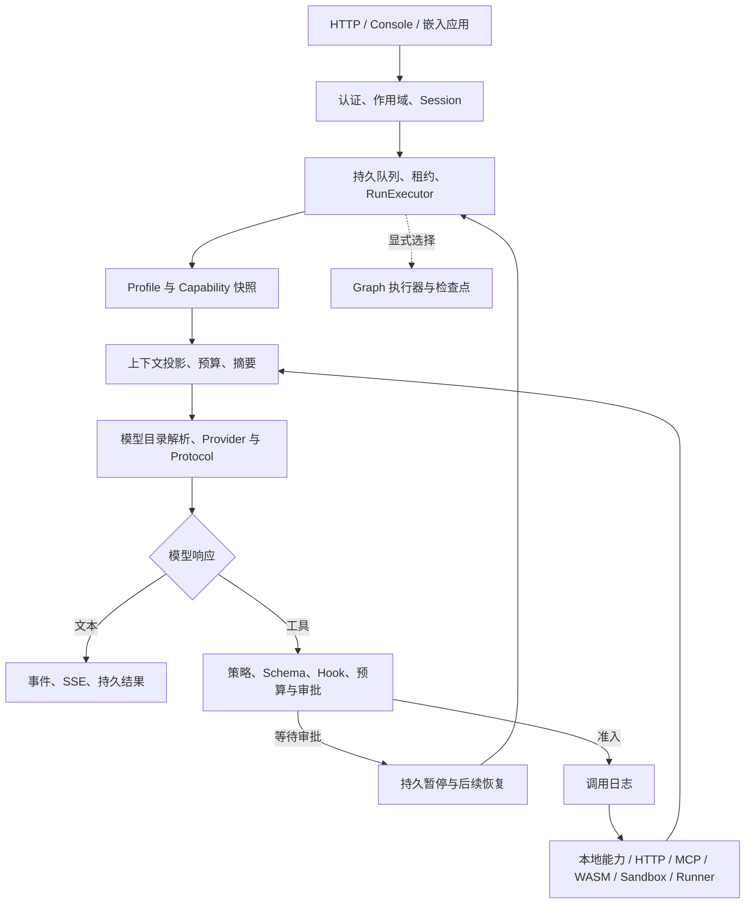

# Agent 模块实现、性能与扩展评估

评估日期：2026-09-06。源码基线：本地 Git `5beed15`。对象仅为 `harness-core`，不包含父目录中的其他 Agent 仓库。本次是源码审阅、官方资料对照和离线微基准；没有新增运行功能，也没有再次调用计费模型。

本文按 **44 个逻辑模块**解释实现与取舍，附录映射当前 **74 个 `pkg/...` Go 包**。逻辑模块按职责划分，一个包可能承担多个模块，不能用包数代替能力数。`cmd`、`internal`、示例和质量工具另列。具体类比与官方依据见[主流框架对比](agent-framework-comparison.md)，测量方法、原始样本及证据限制见[性能记录](performance/2026-09-06-module-benchmarks.md)。[architecture.md](architecture.md)继续作为依赖方向与支持边界的简要说明，本文用于详细评估和扩展决策。

## 结论与阅读口径

**当前项目最适合继续建设成自主管理的 Go Agent 服务基础设施**：作用域和权限、持久会话、人工审批、调用日志、任务恢复、配置与发布治理已经形成连贯实现。它不是只有模型循环的演示，也还不能据此称为功能最完整或性能最好的通用 Agent 框架。

复杂图编排、现成模型与数据连接器、跨 Agent 标准协议、多模态、云沙箱接入，是与成熟生态对比时最需要补齐的部分。Graph 已有实现与持久化，但默认服务中的 Graph 适配器只包裹一个 `core-turn` 节点。Windows 沙箱只提供 Basic；**没有内置 E2B 客户端，也不提供 E2B 兼容服务端 API**。

本次源码复核还确认两个具体边界：默认上下文估算未直接接收后续附加的工具 Schema（M14）；WASM 执行器未显式收紧线性内存或开启运行中 context 终止检查（M27）。因此“有上下文预算”“有 WASM 执行”不能直接推导完整请求 token 保证或充分的运行资源治理。

“可自行扩展”有四种不同含义：

| 标记 | 扩展方式 | 是否修改内核 / 重新构建 | 典型用途 |
| --- | --- | --- | --- |
| E0 配置 | 使用已安装实现的配置、模型连接、Profile、声明 | 通常不改内核；按现有配置接口生效 | 换兼容模型、调整提示与预算 |
| E1 接口 | 实现 Go 接口，在应用组合根注册 | 通常不改内核；新增 Go 实现通常需要重新构建 | 新模型协议、RAG、存储、策略 |
| E2 远程 | 通过现有 HTTP、MCP stdio 或 Private Runner 边界接入 | 业务服务可独立部署；主服务仍需正确注册与授权 | Python 工具、私网服务、外部检索 |
| E3 内核演进 | 改变核心循环、事件或公共语义 | 需要源码变更、迁移评估和回归验证 | 新消息类型、全局并行语义 |

这些不是“把任意代码上传到 Console 后热加载”的承诺。`PluginHost`、`ModuleHost`、能力工厂与模型注册表是不同层次的组合机制，也不允许模型自行扩大权限。

性能分为：**本次实测**、**既有验收记录**、**源码推断 / 尚未专项测量**。未测项不会虚构 QPS、p99 或评分。本次微基准只能比较本仓库同一夹具的局部路径；没有在相同模型、工具、数据、机器、持久化和并发条件下运行其他框架，因此不宣布跨框架速度冠军。

## 模块导航

| 职责 | 模块入口 |
| --- | --- |
| 内核与组合 | [M01 循环](#m01)、[M02 作用域](#m02)、[M03 能力](#m03)、[M04 Profile](#m04)、[M05 PluginHost](#m05)、[M06 工厂](#m06)、[M07 ModuleHost](#m07) |
| 模型与上下文 | [M08 目录](#m08)、[M09 协议](#m09)、[M10 设置](#m10)、[M11 Gate/重试](#m11)、[M12 路由](#m12)、[M13 事件](#m13)、[M14 上下文](#m14)、[M15 摘要](#m15) |
| 保护与编排 | [M16 保护](#m16)、[M17 审批](#m17)、[M18 调用日志](#m18)、[M19 队列/租约](#m19)、[M20 子 Agent](#m20)、[M21 Workflow](#m21)、[M22 Graph](#m22)、[M23 检查点](#m23) |
| 工具与环境 | [M24 工具搜索](#m24)、[M25 MCP](#m25)、[M26 HTTP](#m26)、[M27 WASM](#m27)、[M28 沙箱接口](#m28)、[M29 Windows Basic](#m29)、[M30 Linux/E2B](#m30)、[M31 Runner](#m31) |
| 记忆与数据 | [M32 Memory](#m32)、[M33 RAG](#m33)、[M34 持久化](#m34)、[M35 Artifact](#m35) |
| 服务与治理 | [M36 身份](#m36)、[M37 配置](#m37)、[M38 通知](#m38)、[M39 评估](#m39)、[M40 发布](#m40)、[M41 API](#m41)、[M42 Console](#m42)、[M43 遥测](#m43)、[M44 质量](#m44) |

## 运行链路

图表示默认服务的职责关系，不是所有检查的逐行执行顺序。直接嵌入 `core.Runtime` 时，宿主必须自行配置所需的持久化、审批、遥测等依赖。

默认组合需要特别区分：`cmd/server` 已接上下文组装/摘要、SQL ToolJournal 和 DurableApprover；`Runtime` 的自定义 Hooks、ModelCallGate、CallRateLimiter、FastRouter 与分层 PolicyRegistry 并未因接口存在而自动全部安装。底层 capability 可见性/身份/Schema 检查仍按自身路径执行。ModuleHost、业务子 Agent、Workflow、WASM 与 MCP 工具需要相应注册；Graph 虽有服务注册，也只有显式选择的窄适配。

## 一、内核与组合

### M01 — Agent 循环与 Runtime

**实现 / 状态：** [runtime.go](../pkg/core/runtime.go)、[agent.go](../pkg/core/agent.go)负责 Run 初始化、组合解析、模型调用、工具反馈与终态事件；默认 `general` 使用顺序模型—工具循环。内核只依赖标准库，不直接管理 HTTP、SQL 或厂商 SDK。

**扩展：** E1：向 `Runtime` 注入模型解析器、策略、Hooks、上下文与持久调用组件；编排器通过 [RunExecutor](../pkg/app/runexecutor/runexecutor.go) 的 `RunTurn` / `ResumeTurn` 接入。改变默认循环的并行、消息或重放语义属于 E3，不能仅增加一个 `kind` 实现。

**性能：** 尚无跨框架循环基准。端到端延迟由模型、工具、数据库、队列与恢复共同组成；顺序工具阶段会累计工具耗时。Go 实现和无厂商依赖有利于部署与边界管理，不能直接推出模型任务更快。

**对比 / 取舍：** 与 LangChain `create_agent`、OpenAI SDK 的运行循环职责相近。本项目的服务治理集成更贴合现有需求；快速使用广泛工具生态，优先评估这些 SDK。复杂分支应比较图引擎，而不是扩写这个循环。[C1](agent-framework-comparison.md#c1)、[C2](agent-framework-comparison.md#c2)

### M02 — Scope、Principal 与所有权

**实现 / 状态：** [scope.go](../pkg/core/scope.go)、[types.go](../pkg/core/types.go)定义 global → deployment → product → tenant → workspace → user → session → run 的层级，可按规则跳过层级；会话与调用检查 subject、tenant、scope 的一致性。它是默认服务的隔离基础。

**扩展：** E0/E1：在既有层级创建作用域，注入外部认证到 `Principal` 的映射和自定义策略。新增层级、修改继承或所有权含义属于 E3；不能把不可信请求中的 tenant 字段直接当作已认证身份。

**性能：** 路径验证与匹配有本地 CPU 成本，未单独测量；实际跨租户查询性能还依赖 SQL 索引与查询条件。逻辑作用域不等同于操作系统隔离。

**对比 / 取舍：** 通用框架中的 thread、state、session 主要组织执行状态；本项目把多层作用域直接用于能力和授权。需要这种层级治理时更省重复建设；单用户助手会承担额外概念成本。其他 SDK 的宿主同样可以实现租户权限，不能说它们“无法隔离”。

### M03 — Capability 注册、合同与不可变快照

**实现 / 状态：** [capability.go](../pkg/core/capability.go)定义 Manifest、请求/结果与注册解析；`kind` 是描述，版本化 `contract` 才决定消费方式。跨作用域冲突必须显式 replace/disable，protected 能力不能被下级覆盖，Run 使用固定快照。

**扩展：** E1/E2：实现 `Capability` 并在受信任组合处挂载，或包装远程工具；新合同需要对应消费者。只填一个自定义合同字符串不会自动产生执行行为。替换实现应保留输入、输出、权限和 artifact revision 的可核验含义。

**性能：** 快照与防御复制换取执行一致性，也增加构建与分配成本；未对不同作用域深度和万级能力数量跑压力测试。搜索发现的测量见 M24，不能代表整个注册表。

**对比 / 取舍：** 相比直接把函数列表交给 Agent，本项目更强调分层组合和审计版本；LangChain/Eino 的 typed tools 与组件组合更熟悉、更易接入现成生态。治理复杂度高时前者更合适，简单工具应用后者通常更轻便。[C1](agent-framework-comparison.md#c1)、[C6](agent-framework-comparison.md#c6)

### M04 — Agent Profile 与 Prompt 分层

**实现 / 状态：** [profile.go](../pkg/core/profile.go)、[general_profile.go](../cmd/server/general_profile.go)组合 Agent 提示、模型选择、能力和预算。默认安装厂商中立的 `general`，模型连接仍需配置。每次运行固定 Profile 快照，审批恢复重新解析的组合会记录为新的 resume 证据。

**扩展：** E0：使用已有管理接口配置 `AgentProfileLayer` 与分区 `PromptFragment`；E1：在插件或应用中生成、注册产品 Profile。业务角色和工作流应在 adapters / examples 定义，避免硬编码进内核。不能假设暂停数天后仍无条件沿用已撤销的权限。

**性能：** 大 Prompt、工具 Schema 和历史会扩大请求体及模型 token 成本；Profile 解析未专项测量。模型选择热路径可参考 M08，但不包含提示构建。

**对比 / 取舍：** CrewAI 的 role/goal/backstory 与 OpenAI instructions 对角色表达更直接，本项目的层级覆盖与版本证据更适合受治理的多租户配置。提示表达能力本身不能代表任务质量高低。[C2](agent-framework-comparison.md#c2)、[C5](agent-framework-comparison.md#c5)

### M05 — PluginHost

**实现 / 状态：** [plugin.go](../pkg/core/plugin.go)将插件 Manifest、Capabilities、Profiles 作为一个受作用域约束的组合单元挂载。它管理运行时对象注册，不是通用二进制动态链接器。

**扩展：** E1：在宿主程序实例化插件、声明依赖和能力，再挂载到合法 scope；新增 Go 插件通常重新构建宿主。若要独立发布业务实现，可通过 E2 远程适配保持较小的本地包装。

**性能：** 挂载、校验与快照属于组合阶段成本，未专项测量；频繁重建大量插件会产生额外分配。不能把“可挂载”理解为无成本热替换所有进行中的 Run。

**对比 / 取舍：** 类似其他框架的工具包 / middleware 注册，但多了本项目的作用域规则。已有大量第三方集成时其他生态更方便；需要严格控制插件可见性时该机制有明确价值。

### M06 — 动态能力工厂与声明

**实现 / 状态：** [capabilityruntime/registry.go](../pkg/app/capabilityruntime/registry.go)、[server_dynamic_capability.go](../pkg/server/server_dynamic_capability.go)把受约束声明交给已注册工厂解释，区分管理声明与实际执行实现。

**扩展：** 已存在类型可走 E0；新增工厂实现是 E1，需注册、校验配置、绑定凭据引用并决定权限。它不是任意上传 Go/Python 源码执行的接口，也不会仅凭数据库记录加载未知实现。

**性能：** 校验、实例创建与后端连接成本由工厂决定，未测；昂贵客户端应由适配器控制生命周期，不能假设注册表自动完成所有连接池和缓存管理。

**对比 / 取舍：** 本项目适合把一组已审查工具开放给租户配置；Eino/LangChain 的组件生态适合开发者直接组合更多实现。两者可以经 HTTP/MCP 边界协作，无需把外部框架塞进内核。

### M07 — ModuleHost 生命周期、事务化效果与 Fence

**实现 / 状态：** [pkg/runtime](../pkg/runtime)另行定义 Module、Stage、激活、drain、租约、效果及逆向回滚；CompositionStore、EffectJournal、FenceJournal 有 SQL 适配器。**这是与 `core.Runtime` 不同的可选宿主库，默认 `cmd/server` 未把它装成全局模块热加载系统。**

**扩展：** E1：实现 Module / StagedModule 与受支持 effect，注入持久端口并在应用组合根启用；[coreplugin 适配器](../pkg/adapter/coreplugin)连接相应边界。模型 provider/protocol 的 extension registration 只是元数据，不等于实际传输客户端。

**性能：** 生命周期操作通过协调锁与持久事务换取次序和可恢复性；不适合把高频业务请求都当作模块激活。尚无激活 p99、海量模块或跨进程故障性能数据。

**对比 / 取舍：** 这一层更接近受治理的服务模块生命周期管理，而不是常见的 Agent handoff。确有动态部署与审计需求时可使用；一般 Agent 应用不必为了“插件化”引入完整生命周期层。

## 二、模型与上下文

### M08 — 模型目录、控制面与 ProviderPlan

**实现 / 状态：** [modelcontrol.go](../pkg/app/modelcontrol/modelcontrol.go)、[modelcatalog](../pkg/app/modelcatalog)维护目录、provider/protocol 引用及不可变计划；计划包含可追溯绑定，秘密与网络请求留在外层。默认服务从数据库配置编译这些对象。

**扩展：** E0：为已有 provider/protocol 配置兼容模型、endpoint 与凭据引用；E1：注册新模型控制对象或解析器。支持任意模型名称不等于支持任意厂商原生 API，最终受 M09 协议限制。

**性能：** 本次内存 `Resolve` 中位 **187.8 ns/op、40 B/op、2 allocs/op**，仅单一目录夹具，不含数据库、鉴权、网络与推理。该环节目前没有证据显示是主要端到端瓶颈。

**对比 / 取舍：** 本项目强调 provider 与 protocol 分离及精确绑定证据；通用 SDK 更侧重丰富的厂商模型适配。已有兼容网关时当前方式实用，需要厂商专属能力时应比较 SDK 原生支持范围。

### M09 — 模型执行、协议适配与流校验

**实现 / 状态：** [modelexecution](../pkg/app/modelexecution)、[modelruntime/builtins.go](../pkg/adapter/modelruntime/builtins.go)分开 Provider 传输/认证与 Protocol 编解码。内置 OpenAI Chat Completions、OpenAI Responses、Anthropic Messages；corebridge 将有序增量和终态映射为内核事件。[provider/openai](../pkg/provider/openai)保留封装入口。

**扩展：** E1：实现 Provider / Protocol，声明兼容组合、流边界、错误、usage 与 continuation 的语义并注册。当前 Chat Completions 会持久化并回传工具调用 `extra_content`；这不代表所有协议、所有多模态状态都可透明互换。原生 Gemini 协议尚未内置。

**性能：** 既有 `gemini-3.8-flash` 真实验收通过兼容连接完成两次模型请求，完整审批恢复用例约 **4.82 秒**；不是单请求延迟或 TTFT 基准。本次不重提该计费请求。流解析与复制本身未独立压测。

**对比 / 取舍：** 厂商原生工具、多模态与协议迭代速度优先时，OpenAI SDK、ADK、LangChain/Eino 对应适配值得优先比较；本项目适合保留统一运行治理并逐个补适配器。[C1](agent-framework-comparison.md#c1)、[C2](agent-framework-comparison.md#c2)、[C4](agent-framework-comparison.md#c4)、[C6](agent-framework-comparison.md#c6)

### M10 — 模型设置、缓存与凭据解析

**实现 / 状态：** [modelsettings](../pkg/app/modelsettings)、[adapter/modelsettings](../pkg/adapter/modelsettings)、[credential.go](../pkg/core/credential.go)把数据库设置、热路径读取、凭据引用与实际客户端构建分离。Console 可配置已支持的模型连接；返回给客户端的配置使用受约束秘密视图。

**扩展：** E0：更新已有连接；E1：实现 Repository、resolver 或接入外部秘密管理器。新增协议字段应同步验证、持久格式和编译路径，不能只改 UI。缓存失效与跨实例刷新也属于扩展合同。

**性能：** 热缓存 `CachedRepositoryLoad` 中位 **38.98 ns/op、16 B/op、1 alloc/op**，不含首次载入、SQL、配置变更或密钥解密。不能用此数值声称数据库配置读取仅需几十纳秒。

**对比 / 取舍：** 相比在应用里直接构造 SDK 客户端，本项目已提供服务管理路径；独立脚本则通常不需要这套控制面。供应商 SDK 的身份集成能力仍须逐个对照。

### M11 — 模型调用 Gate 与可选重试

**实现 / 状态：** [model_gate.go](../pkg/core/model_gate.go)、[agent_model_call.go](../pkg/core/agent_model_call.go)为一次精确模型调用授权并产生 accepted proof；Gate 可选，默认 `cmd/server` 未显式注入。另有 [RetryLlmAdapter](../pkg/provider/openai/llm_retry.go) 包装器，针对瞬时传输/429/5xx 有界重试，已经向消费者发出流内容后不重试。它不是核心循环自动重跑所有模型失败的机制。

**扩展：** E1：接入厂商限流、共享配额或熔断实现；同时区分可重试传输失败、已产生输出的调用和未知结果。全局令牌预算、租户费用上限需在适配器/服务层闭环，不应由模型提示承担。

**性能：** 自定义 Gate 的等待和包装器退避会增加尾延迟；未测厂商 429、抖动、重试风暴或跨实例共享限额。Gate 本身不实现并发信号量或分布式配额，一次成功真实会话不能证明高并发限流稳定性。

**对比 / 取舍：** 主流框架也有重试、并发限制或可插入中间件；优势取决于策略是否覆盖部署范围，而不是是否有一个 Retry 字段。已接入集中配额时本项目更便于统一治理，否则需要补工程验证。

### M12 — FastRouter 快速路由

**实现 / 状态：** [fastrouter.go](../pkg/core/fastrouter.go)提供可选规则路由，命中后可直接执行相应能力，仍进入工具保护路径；不是默认存在的语义分类模型，也不是通用规划器。

**扩展：** E1：构造 `FastRouter`，通过 `Add(FastRule)` 注册 Match/Args/Answer，再由 `FastRouterResolver` 为 Profile 返回路由实例；`FastRouter` 本身是具体类型。语义分类属于额外适配，其模型成本、置信度与回退需自行定义，不能绕过 capability 可见性、Schema 和审批。

**性能：** 命中确定性规则可能减少一次模型往返，这是结构上的收益；本次未测命中率、误路由率或实际节省时间。加入 LLM 分类器后未必更快。

**对比 / 取舍：** 类似图框架的条件边或 middleware 分流。固定命令与稳定意图可优先用本模块，开放式任务更适合交给模型循环或通用图编排。

### M13 — Session 事件与消息投影

**实现 / 状态：** [session.go](../pkg/core/session.go)以追加事件为事实来源，派生模型消息；缓存支持增量更新，摘要事件可使投影重建，返回值保留防御复制。当前修复确保恢复非空 Session 后先 Append 不会错误丢失既有历史。事件持久存储见 M34。

**扩展：** E1：实现 `SessionStore`，需要高效追加时实现可选 `SessionAppender`。修改核心消息、事件类型或重放语义属于 E3，必须兼容已有记录和工具调用关联。缓存不能替代持久日志。

**性能：** 2,048 事件的热缓存 `DeriveMessages` 中位 **101.119 µs、约 250.9 KB 分配、641 次分配**。缓存仍复制结果，不能描述为 O(1) 或零分配。历史越长，全量投影与复制成本越值得关注。

**对比 / 取舍：** 与 LangGraph checkpoints、SDK session history 的重叠是“恢复状态”，本项目更侧重统一的 Agent 事件证据。选择取决于需要事件审计还是任意图状态；其他框架同样支持持久化，不能将其描述成仅内存聊天记录。[C1](agent-framework-comparison.md#c1)

### M14 — 上下文组装、预算与近期压缩

**实现 / 状态：** [context.go](../pkg/core/context.go)、[contextassembly/assembler.go](../pkg/app/contextassembly/assembler.go)处理 System、历史消息及其中工具结果，保留输出预算；默认近期压缩可走融合投影路径。默认 token 估算按 UTF-8 字节保守计数，可能较早裁剪，并非厂商精确 tokenizer。`ModelContext` 当前不含独立工具 Schema；[callModel](../pkg/core/agent_model_call.go)在组装后才将 `Tools` 放进 GenerateOptions，因此不能声称该估算完整覆盖工具声明。外层请求字节上限与完整模型 token 窗口是两种不同限制。

**扩展：** E1：提供 `ModelContextAssembler` 函数，实现 `ContextCompactor` 或应用层 `BudgetEstimator` / `TokenEstimator`，注入对应字段；保持工具调用—结果配对、continuation 与预算约束。新增资料源要分配预算；完整工具 Schema token 预留需在知道最终工具集合的边界补齐，不能只替换消息估算器便宣称解决。

**性能：** 8,192 事件夹具中，先全量投影再压缩中位 **410.453 µs / 约 1.017 MB**，融合路径 **23.376 µs / 16,960 B**；局部时间约缩短 **17.56 倍**。默认 120 消息 assembler 中位 **152.197 µs**。这些不是一次 Agent 请求的总耗时，也不证明融合路径对任意历史形态都是常数时间。

**对比 / 取舍：** 本项目显式预算和事件配对有利于可预测请求；LangChain/Deep Agents、CrewAI 等也有上下文管理，不能把自动压缩说成独有。摘要质量与长任务效果需要相同任务集评测。[C1](agent-framework-comparison.md#c1)、[C5](agent-framework-comparison.md#c5)

### M15 — 摘要策略与长期上下文

**实现 / 状态：** [summarizer.go](../pkg/app/contextassembly/summarizer.go)、[extractive_summarizer.go](../pkg/app/contextassembly/extractive_summarizer.go)通过小接口接入滚动摘要。默认服务安装确定性提取式摘要，`MaxMessages=120`、`KeepTail=60`；可选模型摘要需要额外接入。摘要以事件表示，区别于删除原始日志。

**扩展：** E1：实现 `ContextSummarizer`，可按任务分层摘要、引用原始证据或调用 LLM；需要处理失败、取消、输入大小、生成费用和事实丢失。新增摘要器不应把低信任工具输出变成更高优先级指令。

**性能：** 默认提取式避免额外模型请求，但摘要生成成本与质量本次未单测。LLM 摘要可能减少后续 tokens，也会新增一次推理延迟；必须结合多轮总成本评估。

**对比 / 取舍：** 当前默认适合低费用、可重复的历史收缩；长研究任务中的语义摘要、记忆整合仍需定制。框架宣称“自动压缩”不说明事实保留效果更好，应以长期任务回归判定。

## 三、执行保护、恢复与编排

### M16 — Policy、Hooks、Schema、限额与工具保护

**实现 / 状态：** [policy.go](../pkg/core/policy.go)、[hooks.go](../pkg/core/hooks.go)、[agent_tool_guard.go](../pkg/core/agent_tool_guard.go)、[schema.go](../pkg/core/schema.go)、[ratelimit.go](../pkg/core/ratelimit.go)形成共享调用保护路径。模型调用的工具、快速路由与嵌套工具应通过同一边界；工具可见性不等于执行许可。

**扩展：** 在具体 `PolicyRegistry` 中配置 `PolicyLayer`；E1 实现 `RunHooks`、`CallRateLimiter`，在工具准入阶段表达参数约束和预算，审批另接 M17。Schema 验证覆盖实现支持的 JSON Schema 子集，不能假定未知关键字也被执行。内置进程内限流不自动成为分布式配额；自定义能力直接调用外部副作用，也不会自动获得所有嵌套工具保护。

**性能：** Schema 验证、Hooks、序列化与持久准入均有成本，未分别测量。Hooks 可发网络请求，因此其 p99 也可能主导工具启动；应设置边界和超时。

**对比 / 取舍：** OpenAI guardrails、LangChain middleware、ADK callbacks/plugins 可承担相邻职责；本项目把权限与工具调用证据结合得更紧。逻辑 Guardrail 不是沙箱，其他框架也不能仅凭输出校验就获得 OS 隔离。[C1](agent-framework-comparison.md#c1)、[C2](agent-framework-comparison.md#c2)、[C4](agent-framework-comparison.md#c4)

### M17 — 人工审批、持久暂停与恢复

**实现 / 状态：** `Approver` / `DurableApprover` 与 `ApprovalPendingError` 位于 [hooks.go](../pkg/core/hooks.go)，[approval.go](../pkg/storage/approval.go)、[server_approval.go](../pkg/server/server_approval.go)承接 SQL 决策和 HTTP 管理。暂停后释放当前执行，后续实例可以恢复同一 Run；恢复会重新核验身份与当前组合。

**扩展：** E1/E2：接入企业审批界面、外部授权源或审批规则，持久记录与原 session/run/call 关联。不要用一个内存 channel 代替跨重启审批，也不能把重复批准当成重新执行指令。

**性能：** 已有真实 HTTP/SQL 服务重建恢复和两次真实模型调用验收；没有测数百万待批任务、跨地区审批或强杀恢复 p99。人工等待可能远大于框架时间，应独立统计。

**对比 / 取舍：** LangGraph interrupts、OpenAI SDK 可序列化运行状态、Eino checkpoint/HITL 都有对应能力。本项目的优势是现有 SQL、授权与 HTTP 路径已组合，不能宣称只有本项目能持久审批。[C1](agent-framework-comparison.md#c1)、[C2](agent-framework-comparison.md#c2)、[C6](agent-framework-comparison.md#c6)

### M18 — 持久工具调用日志与未知结果处理

**实现 / 状态：** [tool_journal.go](../pkg/core/tool_journal.go)、[repair.go](../pkg/core/repair.go)记录接受、执行与结果证据；默认服务注入 SQL ToolJournal。稳定 call identity 用于去重与恢复；非幂等工具执行结果未知时关闭自动重放，避免猜测副作用。

**扩展：** E1：实现 ToolInvocationJournal，或给工具接入可验证幂等键 / 外部状态查询。新增外部副作用必须设计“服务已执行但本地未落库”的处理，单靠内部事务无法原子提交第三方世界。

**性能：** 每次受保护工具调用多出持久交互，可能增加数据库写入与争用；暂无单独 journal p99。127.38 完整会话/秒的既有本地负载包含这类成本，但不是 journal 独立吞吐。

**对比 / 取舍：** 本项目对此有明确合同，适合审批后写外部系统；LangGraph/Eino 恢复也需要关注节点重入与幂等。任何框架都不能仅凭 checkpoint 承诺任意远端非幂等操作严格 exactly-once。[C1](agent-framework-comparison.md#c1)、[C6](agent-framework-comparison.md#c6)

### M19 — 异步队列、租约、Worker 与存活调度

**实现 / 状态：** [server_run_worker.go](../pkg/server/server_run_worker.go)、[server_lease.go](../pkg/server/server_lease.go)、[run_control.go](../pkg/storage/run_control.go)、[sql_leases.go](../pkg/storage/sql_leases.go)承接领取、续租和恢复；[runliveness/scheduler.go](../pkg/app/runliveness/scheduler.go)集中调度活动 Run 的存活任务。它们位于服务层，不是每次直接调用内核都自动启动的后台系统。

**扩展：** E0：使用既有 worker / 时间配置；E1：实现共享 Store、时钟或替代服务调度器，保持租约代次和失去所有权后的停止语义。要改成外部消息队列，需要实现领取、重复投递和租约合同，不能仅替换发送函数。

**性能：** 既有 8 客户端 / 4 worker / 2 服务对象 / PostgreSQL 的 2,048 次本地模型会话全部成功，**127.38 次/秒、p95 168 ms**。本次调度器微基准每批注册 1,000 活动项并关闭，中位 **375.569 µs**；它不是 1,000 并发推理能力。

**对比 / 取舍：** 本项目已包含自托管服务调度；LangGraph Agent Server、Microsoft hosting 是更接近的比较对象，不能拿它与一个纯函数式 SDK 比“谁自带队列”就宣布全面胜出。跨 OS 进程、长稳态与故障迁移仍需补测。[C1](agent-framework-comparison.md#c1)、[C3](agent-framework-comparison.md#c3)

### M20 — Subagent 与持久委派

**实现 / 状态：** [subagent.go](../pkg/extensions/subagent/subagent.go)、[link.go](../pkg/extensions/subagent/link.go)把子 Agent 包装为能力。默认深度 3，存在委派工具预算；`MaxChildren=32` 限制进程内保留的子会话并淘汰旧项，不代表全局持久委派并发上限。父 session/run/call 对应稳定子身份。**同时提供 `Sessions`、`Links` 与完整父调用身份才走持久新委派**；都不提供时可走进程内路径，只提供部分依赖不能视为自动降级。默认 `general` 不是自动开启的 Agent 群聊团队。

**扩展：** E1：注册子 Profile 和能力，注入 SessionStore / DelegationLinkStore；以合同缩小子权限与预算。子任务等待审批需向父 Run 传播暂停，不能产生失去父关联的孤立审批。

**性能：** 子 Agent 会增加模型轮次、上下文和存储；递归限制用于控制放大。尚无树深、扇出、并行度与 token 成本分布的基准，不能将包名 `subagent` 理解为无限并行调度器。

**对比 / 取舍：** 当前适合受控的父子任务委派。LangGraph subgraph、OpenAI handoff / Agent 工具、ADK 多 Agent、CrewAI delegation 有不同调度语义；开放团队协作和复杂监督编排优先试这些已有范式。[C1](agent-framework-comparison.md#c1)–[C5](agent-framework-comparison.md#c5)

### M21 — 确定性 Workflow 能力

**实现 / 状态：** [workflow.go](../pkg/extensions/workflow/workflow.go)按顺序执行命名 Step，将前序输出引用传给后续能力；步骤数有界，使用受保护嵌套调用和稳定子 call ID，审批暂停可以向上传播。它不是并行 DAG 引擎。

**扩展：** E1：通过 `NewCapability` 组合受支持步骤和已注册工具；E0 只适用于宿主已经提供的声明入口。复杂分支、循环、并行和补偿流程不应伪装成越来越长的顺序工具列表。

**性能：** 正常路径时间大致累计各步骤耗时，加上每步的校验与日志；没有该模块的独立测量。恢复利用既有结果减少重复工作，但不解除外部幂等要求。

**对比 / 取舍：** 固定“小流水线”使用当前实现简单可审计；需要 fan-out/fan-in、复杂状态机或多种调度方式时，LangGraph、Eino、ADK 图编排更值得优先评估。[C1](agent-framework-comparison.md#c1)、[C4](agent-framework-comparison.md#c4)、[C6](agent-framework-comparison.md#c6)

### M22 — Graph 引擎与 RunExecutor 选择

**实现 / 状态：** [execution/graph](../pkg/execution/graph)提供节点、边、条件、Reducer、绑定、重试与恢复状态机；[adapter/runexecutor/graph](../pkg/adapter/runexecutor/graph)把它接入 RunExecutor 精确 ID/version 注册。当前执行路径按节点状态推进，不能描述成 Pregel 并行 superstep 引擎。默认服务只有显式选择的单 `core-turn` 图包装。

**扩展：** E1：构造图、节点实现与受约束绑定，注册专用执行器；[graph-review 示例](../examples/graph-review/README.md)展示 draft/review/finalize 三节点。任意业务图的持久定义、编辑器、动态加载与生产控制面尚未由这个示例自动提供。

**性能：** SQLite/PG 图重建恢复已有正确性测试；本次没有测节点吞吐、checkpoint 大小、并行分支或大图调度。当前不应以 Graph 名称推断与其他图框架能力等价。

**对比 / 取舍：** 需要精确绑定和受治理的窄图执行可以继续扩展；面向复杂通用图，LangGraph、Eino 和当前 ADK 2.x 是更充分的候选。若继续自研，应先明确缺的是图语义还是产品编辑器。[C1](agent-framework-comparison.md#c1)、[C4](agent-framework-comparison.md#c4)、[C6](agent-framework-comparison.md#c6)

### M23 — Graph 状态、检查点、历史与段授权

**实现 / 状态：** [extensions/graph](../pkg/extensions/graph)定义标准库合同；[sql/graphcheckpoint](../pkg/adapter/sql/graphcheckpoint)持久化 CAS head、不可变版本与追加 transition，当前 schema v41；[sql/graphsegment](../pkg/adapter/sql/graphsegment)处理段租约。ContextPlanner、SandboxAuthorizer、ApprovalAuthorizer 在 [ports.go](../pkg/execution/graph/ports.go)注入，不凭图节点文本授予权限。

**扩展：** E1：实现 Checkpoint Store / 可选 HistoryStore、段租约与授权端口；内存实现用于测试与嵌入。自定义存储须保持比较交换、版本历史和 transition 的原子性，不能只保存最后一份 JSON 就声称等价。

**性能：** 每个持久边界有序列化和事务开销；较大图状态会放大存储与查询成本。暂无状态大小—吞吐曲线、历史保留压力或异地数据库测试。

**对比 / 取舍：** LangGraph 同样有 checkpointer、任务写入与不同 durability 模式，Eino 同样有 checkpoint/interrupt。本项目更强调自己的段租约与授权证据；通用图恢复的易用性、性能和成熟度仍需对等试验。[C1](agent-framework-comparison.md#c1)、[C6](agent-framework-comparison.md#c6)

## 四、工具发现与执行环境

### M24 — 工具目录、检索与渐进披露

**实现 / 状态：** [toollib](../pkg/extensions/toollib)维护目录索引与 Searcher；内置关键词、字符 trigram 混合排序与 hashing 实现。它们不是经过训练的语义 embedding 模型。[disclose.go](../pkg/core/disclose.go)允许按需发现工具，再披露当前相关 Schema，执行仍须授权。

**扩展：** E1：实现 `Searcher` 并通过 `SetSearcher` 接入向量、混合检索或重排；E0/E2：接入已有工具库声明。向量库返回结果必须重新对照可见快照，搜索命中不能扩大权限。

**性能：** 500 工具、TopK 8 的夹具中，索引搜索中位 **203.015 µs / 155,580 B / 521 allocs**；旧快照并分词路径 **986.475 µs / 约 1.484 MB / 11,051 allocs**，局部约 **4.86 倍**。未测万级工具或检索准确率。

**对比 / 取舍：** 大量工具场景按需披露有降低模型输入的潜力；其他框架也可使用工具检索或自定义选择器。业务同义词与跨语言语义优先时，应替换检索实现并评测召回，不能把 hashing 当成熟向量 RAG。

### M25 — MCP 工具接入

**实现 / 状态：** [mcp.go](../pkg/execution/mcp.go)、[mcp_library.go](../pkg/execution/mcp_library.go)作为客户端连接 stdio MCP 工具进程，支持工具清单和调用，并限制库存、分页和响应边界。当前没有内置 Streamable HTTP MCP 客户端，也未把本服务导出为 MCP server。

**扩展：** E2：连接与现有 stdio 合同兼容的服务；启动命令来自受信任配置。E1：另写远程 transport、会话生命周期和认证适配；接入 MCP 不自动把子进程放进 M29 的沙箱。

**性能：** 连接在调用间复用，但同一 `mcpConnection` 的请求在互斥锁下串行处理，慢调用会影响该连接上的后续请求；启动、握手、刷新和 IPC 另有成本。未测冷启动、连续调用或断连恢复分布，目录缓存不能代替实际工具执行基准。

**对比 / 取舍：** 只需本地 stdio 工具时可用当前实现。OpenAI Agents SDK 的官方资料已包含 stdio、Streamable HTTP 与 hosted MCP 路径，需要这些现成能力时其接入成本更低；跨语言或多传输部署不宜声称本项目 MCP 已全面等价。[C2](agent-framework-comparison.md#c2)

### M26 — HTTP 能力执行与 SSRF 边界

**实现 / 状态：** [http_executor.go](../pkg/execution/http_executor.go)、[ssrf.go](../pkg/execution/ssrf.go)把能力转成受约束 HTTP 请求；对 URL 与实际拨号地址实施检查，使用凭据引用，限制响应，并控制重定向和代理行为。它与对外管理 API 是不同模块。

**扩展：** E2：包装现有内部或外部业务 API；E1：新增认证/格式适配。接入前要明确允许的目的地、超时、输入输出和幂等合同，不将任意模型生成 URL 直接当作可信 endpoint。

**性能：** 主要时间通常在网络与业务服务，另有 DNS、校验、编码和响应复制；未做连接复用、并发与大响应专项测试。额外远程边界也会增加运维和排错路径。

**对比 / 取舍：** 这是跨语言扩展最直接的现有入口之一。成熟框架的现成服务连接器可能减少封装代码；没有对应连接器或需精确网络策略时，自有 HTTP 适配更可控。

### M27 — WASM 执行

**实现 / 状态：** [wazero.go](../pkg/execution/wazero.go)使用 wazero 执行 WASI 模块，限制模块文件、参数和捕获输出；每次调用创建新的 runtime。当前使用 `wazero.NewRuntime(ctx)`，没有显式设置 `WithMemoryLimitPages` 或 `WithCloseOnContextDone(true)`。所用 v1.12.0 的文档说明，执行中 context 终止检查默认关闭，线性内存未被模块自身限制时默认允许到 4 GiB。因此当前实现不能承诺任意不可信计算循环可按 context 及时终止，也不能把模块文件大小上限说成运行内存上限。[wazero RuntimeConfig](https://pkg.go.dev/github.com/tetratelabs/wazero@v1.12.0#RuntimeConfig)

**扩展：** E1：用兼容工具链编译模块，按现有调用 ABI 接入；新增 host function / WASI 能力会扩大可访问面，需逐项声明。适合可编译为 WASM 的确定性计算，不能直接运行任意带本机依赖的 Python 项目。

**性能：** 每次新 runtime 与实例化使重复调用承担读取/编译等成本，当前没有共享编译缓存；未测冷/热延迟或与原生实现的同计算基准。先补资源与终止配置并用有界验收验证，再评估缓存复用；不能把源码注释中的“微秒”当作本项目实测。

**对比 / 取舍：** 适合继续建设为嵌入式计算选项，但当前资源治理有具体待补项；完整操作系统工具链更适合容器/远程沙箱。CrewAI 的可选 Docker 代码执行、OpenAI Sandbox Agents 属于不同粒度，不能直接按“都有 sandbox”判断相同。[C2](agent-framework-comparison.md#c2)、[C5](agent-framework-comparison.md#c5)

### M28 — Sandbox 合同、注册与准入适配

**实现 / 状态：** [sandbox.go](../pkg/execution/sandbox/sandbox.go)、[registry.go](../pkg/execution/sandbox/registry.go)定义 Provider / Session、精确版本选择及 assurance、资源、网络和挂载合同；[sandboxexec](../pkg/adapter/sandboxexec)把已接受工具调用、argv、输出和租户产物关联起来。能力不足时明确拒绝，不隐式退回宿主执行。

**扩展：** E1：为容器、VM 或云沙箱实现 Provider / Session，再在组合根注册；E0 只能选择已注册实现。适配器必须报告实际保障，不能把供应商营销名称直接映射为更强的 assurance。

**性能：** 抽象层开销未独立测量，实际启动、文件传输、执行和清理由 provider 决定。跨本机、容器和云端的延迟需分别测冷启动与复用场景。

**对比 / 取舍：** 本项目的优势是显式要求与实际保障匹配；现成沙箱生态和开发体验仍较少。若目标是快速接 E2B，OpenAI SDK 当前官方 provider 列表已有客户端，而本项目需新增适配。[C2](agent-framework-comparison.md#c2)

### M29 — Windows current-user Basic 沙箱

**实现 / 状态：** [local_provider_windows.go](../pkg/execution/sandbox/local_provider_windows.go)及 `windows_current_user_*` 使用普通 Medium 来源、restricted token、服务拥有的 workspace ACL、匿名 stdio、Job Object 进程树清理与默认 private desktop。每进程只允许一个活动 Session；拒绝 elevated 来源。运行终端用户不要求安装 Go、.NET 或 PowerShell 7。

**扩展：** 可通过 E1 增加独立 provider；当前 Basic 的已接受范围不应偷偷升级成专用账号/WFP 实现。它报告 **NetworkHost、NetworkIsolation=false**，严格 Disabled/Isolated 要求失败；`WRITE_RESTRICTED` 仍有 Everyone/logon 可写例外，不能承诺宿主文件系统完全隔离。

**性能：** 既有真实 Medium 五用例约 **5.17 秒**，其中包括配置约 5 秒的超时场景；不能把总测试时间视为单次沙箱启动时间。单活动会话是明确并发瓶颈，未测启动 p95 或长期高频清理。

**对比 / 取舍：** Windows 本地基础限制与可审计清理是当前定位；强网络隔离、多任务容器和远程 Linux 开发环境应选择满足要求的其他 provider。不能用“沙箱”名称把 Basic 与 E2B/VM 的保障画等号。详见[既有验收](verification/2026-09-06-windows-basic-acceptance.md)。

### M30 — Linux 本地执行与 E2B 缺口

**实现 / 状态：** [local_provider_linux.go](../pkg/execution/sandbox/local_provider_linux.go)依赖 `bwrap` / `prlimit`，按支持条件实施边界，缺失时拒绝；[osconfinement.go](../pkg/execution/osconfinement.go)等另有执行辅助路径，不能把所有子进程入口都统称为同一个 sandbox provider。本仓库当前没有 E2B SDK/API client，也没有 E2B 兼容服务端。

**扩展：** E1：新增 E2B Provider / Session，处理远程创建/恢复/销毁、命令与流、上传下载、产物所有权、超时与取消、网络/资源 assurance、凭据和幂等。若要“外部 E2B SDK 连接本项目”，则另需实现对应服务端 API；它与调用 E2B 云服务是两个项目。

**性能：** 本次在 Windows 上没有新增 Linux 原生验收，也未创建 E2B sandbox；无法给出其冷启动或远程文件吞吐。网络和供应商队列需纳入未来测试。

**对比 / 取舍：** 本地 Linux 受限执行可沿用当前接口；希望立即得到云沙箱集成，现成 SDK 更省接入工作。保留自有租户、审批和产物治理时，可将云供应商放在外层适配器，而不改 Agent 内核。

### M31 — Private Runner 与远程 Worker

**实现 / 状态：** [runner.go](../pkg/extensions/runner/runner.go)、[server_runner_protocol.go](../pkg/server/server_runner_protocol.go)提供任务领取、结果提交、重试与 fence 的私有协议和 Store；[runner-worker 示例](../examples/runner-worker)展示远程执行者。持久部署应使用带 Store 的 Hub，不能只靠进程内状态。

**扩展：** E2：用适合业务环境的语言实现协议客户端；E1：增加执行后端、持久 Store 或管理策略。需保持租户/任务所有权、attempt 与重复结果处理，网络断开不表示业务未执行。

**性能：** 轮询/领取间隔、网络、租约与远程工具决定延迟，未测跨网络大规模 worker。SQL 幂等和恢复测试是正确性证据，不能替代吞吐基准。

**对比 / 取舍：** 适合私网、特殊硬件或隔离环境执行。它不是 E2B、A2A 或 MCP 的兼容实现；需要标准跨框架 Agent 通信时，新增协议适配比让客户端误用 Private Runner 更合理。

## 五、记忆、检索与数据

### M32 — 长期 Memory

**实现 / 状态：** [memory.go](../pkg/extensions/memory/memory.go)定义 `Store.Remember/Recall/Forget` 与进程内参考存储；[standard.go](../pkg/extensions/memory/standard.go)提供标准工具，默认服务接 SQL 持久实现。记忆按精确所有权 scope 存储，查询/标签有界，删除经过相应审批。核心 MemoryEntry 只是数据合同。

**扩展：** E1：实现 Store 接向量库、外部记忆服务或业务数据库；保持 scope、更新和删除语义。E2：通过工具调用外部知识服务。自演化记忆、冲突合并、事实衰减和隐私保留策略仍需应用设计。

**性能：** SQL 投影与归一化字段减少部分重复解析，但本次未测不同记忆量、标签分布或检索质量。默认有界 Store 不能被描述成无限量向量记忆系统。

**对比 / 取舍：** 本项目适合明确可查、可删、可审计的用户记忆；LangGraph 的跨线程 Store 与其他框架的 memory abstractions 同样可扩展。语义记忆效果更依赖后端与策略，而不是接口名称。[C1](agent-framework-comparison.md#c1)

### M33 — RAG 检索

**实现 / 状态：** [rag.go](../pkg/extensions/rag/rag.go)的 `Index.Ingest/Search` 提供按可见 scope 前缀检索的合同；当前参考与 SQL 路径以关键词/标签和预处理投影为主。默认 `general` 可调用 RAG search。没有完整内置文档解析 → chunk → embedding → ANN → rerank 生产流水线。

**扩展：** E1：实现 Index 接向量/混合检索系统；E2：调用独立 RAG 服务。必须保留授权过滤、来源、分块标识、大小限制和引用可追溯性；只在召回之后过滤可能造成召回不足或跨租户风险。

**性能：** 未提供 Recall@K、MRR、nDCG、答案忠实度或百万文档延迟数据。工具目录搜索基准不等于 RAG 检索基准，SQL 查询正常通过也不等于语义质量合格。

**对比 / 取舍：** RAG 是产品核心且需要广泛数据连接器时，LlamaIndex、Eino 或 LangChain 生态更值得优先采用；当前项目可作为授权、会话和执行外壳调用它们。简单小规模关键词资料库可继续用现有实现。[C1](agent-framework-comparison.md#c1)、[C6](agent-framework-comparison.md#c6)、[C7](agent-framework-comparison.md#c7)

### M34 — Session 持久化、SQL 与事件查询

**实现 / 状态：** [session_store.go](../pkg/core/session_store.go)、[pkg/storage](../pkg/storage)提供 File、SQL、S3 等会话/对象实现，支持可选事件追加、write-behind 与证据查询。SQL 支持 SQLite / PostgreSQL，当前累计 schema **v41**，有启动迁移、锁与未来版本拒绝路径。各 Store 能力不应假定完全相同。

**扩展：** E1：实现 SessionStore / SessionAppender、查询和相关业务 Store；使用新数据库需保留原子性、乐观并发、所有权过滤和恢复约束。仅实现 session Save/Load 不会自动支持 SQL 队列、审批、发布与 Graph 历史。

**性能：** 增量追加可减少整份会话写放大；write-behind 要区分内存接受与 durable flush，异常退出仍需按其合同处理。既有本地 PG 并发基线已覆盖部分完整链路，本次未做数据库大小增长、SQLite 锁竞争和远端 PG 压测。

**对比 / 取舍：** 本项目自带的服务级存储范围较广，代价是 migration 与多 Store 一致性维护。LangGraph/Eino 的 checkpoint 后端聚焦编排恢复，不能直接当作整个 SaaS 数据层替代品；也不能据此说它们缺少持久化。

### M35 — Artifact、对象存储流与迁移

**实现 / 状态：** [objectstore.go](../pkg/storage/objectstore.go)、[dynamicstore.go](../pkg/storage/dynamicstore.go)、[artifactmigration](../pkg/app/artifactmigration)及 SQL/存储适配器处理文件与 S3 对象、可选 streaming get/put、配置切换、迁移代次、CAS 与日志。流接口是可选能力；仅有 Put/Get 的实现可能仍需整对象缓冲。

**扩展：** E1：实现 ObjectStore 和可选 streaming 接口，或迁移控制端口；E0：配置已有本地/S3 连接。需要验证 key/path 边界、tenant 归属、校验、迁移重试和中断一致性，不能简单把换 endpoint 当作旧产物迁移完成。

**性能：** 大产物会放大内存、磁盘与网络压力，streaming 可降低峰值缓冲但不消除带宽限制。本次未跑真实 S3，也未测 GB 级产物、跨桶迁移或并发读取。

**对比 / 取舍：** ADK 等框架有 artifact 概念，本项目额外覆盖自己的存储配置和迁移治理。若只需少量附件，当前机制可能偏重；长期自托管产物库更能受益。对象存储供应商性能与 Agent 框架性能应分开评估。

## 六、服务与运营治理

### M36 — 身份、账号、认证与管理授权

**实现 / 状态：** [app/identity](../pkg/app/identity)、[server/auth.go](../pkg/server/auth.go)、[sql_accounts.go](../pkg/storage/sql_accounts.go)提供账户、首次管理员激活、登录状态与管理服务；HTTP 通过类型化适配器把已认证身份转换成应用调用。账号认证、角色权限与 M02 的资源作用域共同起作用。

**扩展：** E1：实现 `Authenticator`、身份服务端口或外部 IdP 适配。现有账号体系不等于内置完整企业 OIDC/SSO/SCIM；新增此类能力需要会话失效、权限映射与管理操作审计闭环。

**性能：** 密码验证、数据库查找和认证缓存的成本未单独测量。既有并发会话基线使用注入固定测试 principal，不包含真实登录、公网代理或多租户混合鉴权。

**对比 / 取舍：** 自托管 SaaS 可以复用现成账号路径；纯 Agent SDK 通常交给宿主做身份。与托管 Agent 平台比较时需另看其企业身份和部署方案，不能按 SDK 中没有登录页面判断安全性较弱。

### M37 — 通用 Settings 与秘密视图

**实现 / 状态：** [app/settings](../pkg/app/settings)、[app/secretview](../pkg/app/secretview)、[app/storageconfig](../pkg/app/storageconfig)把类型化配置、部分更新、修订冲突与秘密展示分开；[SQL settings](../pkg/adapter/sql/settings)和 HTTP adapters 承接持久管理。环境变量主要承载启动基础设施，模型与对象存储走数据库/Console。

**扩展：** E1：增加设置合同、验证器、Repository 和必要的客户端表单；敏感字段需遵守存在性/保留/替换语义，避免“空字符串”与“未提交”混淆。E0 适用于已有设置类型。

**性能：** 配置不是推理主路径中的大计算，但并发更新、跨实例刷新和解密仍有成本；未专项压测。不能把模型设置热缓存数值套用于所有配置端点。

**对比 / 取舍：** 本项目适合由运营界面管理连接和部署参数；SDK 构造参数对开发者脚本更直接。业务变化频繁时类型化设置降低歧义，但会增加维护 DTO/数据库/UI 的工作。

### M38 — Notification 渠道与目标管理

**实现 / 状态：** [app/notification](../pkg/app/notification)、[notification/coretool](../pkg/adapter/notification/coretool)、[notification/webhook](../pkg/adapter/notification/webhook)分离渠道、opaque TargetRef 与真实地址；目标配置有 SQL 适配。默认 Agent 可发现渠道并在受保护审批路径发送，发送与调用日志关联。

**扩展：** E1/E2：实现邮件、Slack 等渠道适配器或连接自有通知服务；不得把“可定义渠道”当作所有第三方渠道已经内置。新增渠道需定义目标授权、去重、速率、失败与未知投递状态。

**性能：** 延迟和吞吐主要取决于外部渠道；本次无真实通知发送或批量投递基准。审批与幂等增加治理价值，也有持久写入成本。

**对比 / 取舍：** 强调发送审批和租户目标管理时当前设计可复用；需要大量现成 SaaS 工具时，成熟框架连接器通常更省封装。外部通知成功与“请求已被接受”必须按渠道语义区分。

### M39 — Evaluation、数据集与回归门禁

**实现 / 状态：** [pkg/evaluation](../pkg/evaluation)包含不可变数据集、Case 执行、Evaluator 注册、持久结果、恢复、回归 gate 与能力声明兼容性校验。默认评估权限以只读/幂等等约束收缩，避免任意生产副作用。

**扩展：** E1：实现 Evaluator 与数据/结果 Store，加入业务事实、工具轨迹、成本和质量指标。LLM-as-judge 可以自建，但须记录模型、提示、版本和不确定性；包存在不意味着已经拥有行业标准任务集或领先分数。

**性能：** 评估总耗时取决于 Case 数、模型调用和评分器；本次只做离线微基准，没有新跑全套任务质量评测。确定性 gate 成本和计费评估成本应分开。

**对比 / 取舍：** 本项目适合把评估与自己的 release gate 联动；LangSmith 等平台的实验管理/观察生态应作为独立产品维度比较。尚无同任务质量数据，因此不能断言本项目的 Agent 更聪明或成功率更高。[C1](agent-framework-comparison.md#c1)

### M40 — Profile Release、Canary 与回滚

**实现 / 状态：** [control/release.go](../pkg/control/release.go)、[control/canary.go](../pkg/control/canary.go)处理 Profile 发布快照、日志、恢复、评估 gate、确定性流量分配和共享存储修订同步。它治理 Agent 配置/版本，不等于替代 Kubernetes 或完整流量网关。

**扩展：** E0/E1：配置现有发布流程、提供业务 gate 和外部发布系统适配。新策略必须记录 assignment 与恢复语义，不能只按内存随机数分流再宣称可重放。

**性能：** 分配逻辑与发布同步成本未独立测量；发布通常低频，但跨实例一致性与大量历史记录仍需专测。不能从模型 Resolve 的纳秒基准推导 release 操作性能。

**对比 / 取舍：** 需要自有审批/评估驱动发布时有直接复用价值；很多 SDK 把上线流程交给宿主或托管平台，比较时应计入那部分能力与成本。没有实际发布运维数据，不能给出普遍可靠性排名。

### M41 — HTTP API、JSON 合同与 SSE

**实现 / 状态：** [pkg/server](../pkg/server)、[adapter/httpapi](../pkg/adapter/httpapi)、[OpenAPI](../openapi/harness-core-v1.yaml)提供会话、运行、审批、资源和管理接口；当前核验记录为 **102 个 `/v1` 操作**。SSE 输出实时观察，持久事件查询支持游标；不要假设 SSE 连接或 `Last-Event-ID` 自动保证所有消息重放。

**扩展：** E1：新增类型化 HTTP adapter 并同步 OpenAPI/授权；E2：任何语言调用现有 HTTP API。当前没有正式多语言客户端 SDK、gRPC、入站 MCP 或 A2A 的完整内置服务面。

**性能：** 编码、事件扇出、慢客户端与查询分页都有成本；既有并发基线覆盖部分 HTTP 链路，未覆盖大量 SSE 长连接与背压恢复。健康检查吞吐不能当作 Agent 会话吞吐。

**对比 / 取舍：** 自托管服务接入面是本项目的实用部分；LangGraph Agent Server、Microsoft hosting 等服务层更可比。只需要在现有应用内调用模型循环时，SDK 嵌入更少一层网络和部署。

### M42 — 内嵌 Console

**实现 / 状态：** [pkg/console](../pkg/console)嵌入静态前端，调用同一套受授权 API，管理配置、会话、运行证据和相关运营对象。默认 `general` 便于首次配置模型后开始对话；UI 本身不授予绕过后端规则的权限。

**扩展：** E1：增加界面与相应 API；也可以 E2 使用已有 API 自建产品前端。当前 Console 不是通用可视化多节点 Graph 编辑器，也不是面向所有行业的成品工作台。

**性能：** 未做浏览器首屏、长会话列表、大量日志渲染或可访问性专项评估。后端 QPS 与前端可用性是不同指标。

**对比 / 取舍：** 自带管理入口能减少部署初期工作；成熟 Agent 平台的调试/可视化界面可能更完整，但通常是 SDK 之外的产品面。业务 UX 宜放外层，保持基础仓库的通用性。

### M43 — Telemetry、日志与构建信息

**实现 / 状态：** [core/telemetry.go](../pkg/core/telemetry.go)定义中立接口，[telemetry/otel](../pkg/telemetry/otel)适配 OpenTelemetry；[logging](../pkg/logging)与 [buildinfo](../pkg/buildinfo)提供运行诊断。高基数运行关联主要进入 span，避免自动复制到 metrics；遥测失败有隔离处理。

**扩展：** E1：注入 exporter/telemetry 或日志实现，接现有观测后端；明确采样、敏感内容与属性基数。trace 不是持久审批事实来源，丢采样不能影响运行正确性。

**性能：** 未在本次测无遥测/全采样/远端 exporter 的差值；额外属性、同步导出与大日志可能显著放大成本。默认接口轻量不代表任意 exporter 都低开销。

**对比 / 取舍：** OTel 适合已有中立观测栈；OpenAI 内置 tracing、LangSmith 等工具提供不同的 Agent 调试体验。需要统一企业监控时当前接口方便，任务轨迹调试效果应实际试用比较。[C1](agent-framework-comparison.md#c1)、[C2](agent-framework-comparison.md#c2)

### M44 — 测试、架构边界与性能工具

**实现 / 状态：** [测试支持](../internal/testdb)、[PostgreSQL 门禁](../scripts/test-postgres)、[OpenAPI 核验](../scripts/verify-openapi)、[性能工具](../internal/perfp0)及包内测试覆盖合同和集成。既有验收记录包含全仓测试、构建、vet、Staticcheck、针对性 race、真实 PG 与 Windows Medium。内核预算约束依赖和公共表面；当前记录为 34 个生产文件、8,624 非空物理行、公共表面计数 903，**不是 903 个接口**。

**扩展：** 新 adapter 应增加能验证合同的测试和必要真实环境入口；新执行语义要补恢复、重复、权限和未知结果案例。公共 API 仍是 pre-GA，不能把“通过架构预算”当成兼容性保证或完整安全审计。

**性能：** 本次运行 6 个包、9 个微基准场景、每项 3 样本；没有为文档再跑全仓测试，也没有新跑计费模型。既有全仓通过数与条件跳过见[验收记录](verification/2026-09-06-assessment-closure.md)，不把跳过说成已验证。

**对比 / 取舍：** 现有测试证据支持继续开发，但未提供外部采用规模、长期事故率或跨框架性能优胜证据。应保持小接口和明确合同，优先补真实部署验证，而不是仅增加更多抽象或追求测试数量。

## 尚未具备或不能直接等价的能力

| 能力 | 当前状态 | 合理扩展位置 | 何时值得做 |
| --- | --- | --- | --- |
| E2B 云客户端 | 未内置、未实测 | M28/M30 独立 provider | 明确需要云端 Linux 环境、复用和弹性时 |
| 对外 E2B 兼容 API | 未实现 | M41 新服务适配层 | 外部应用必须直接用 E2B SDK 连接本服务时 |
| 原生 Gemini 协议 | 未内置；既有测试走兼容连接 | M09 Protocol / Provider | 需要兼容层未覆盖的厂商专属功能时 |
| 原生多模态、实时语音/视频链路 | 核心主路径以文本与工具为主；不是通用完整实现 | 模型协议适配；必要时评审 M13 事件演进 | 有确定输入输出与持久合同后 |
| 任意图设计、加载和可视化编辑 | 有底层图与示例；服务端当前窄适配 | M22/M23/M42 | 真实业务需要多节点配置和运营时 |
| 自主规划、通用 swarm/群聊调度 | 可组合子 Agent；没有完整通用平台 | M20/M22 外层编排 | 先以任务集证明比顺序流程更有效 |
| MCP Streamable HTTP / 入站 MCP | 当前 stdio 客户端之外未内置 | M25/M41 | 明确远程互操作对象后 |
| A2A 与正式多语言 SDK | 未内置完整能力 | M41 adapter / 外部 SDK | 出现稳定外部消费者后 |
| 完整语义 RAG 生产管道 | 有 Index 合同与关键词实现 | M33 接成熟检索服务/组件 | 知识问答质量成为主要瓶颈时 |
| Windows 强网络隔离 | Basic 明确不提供 | 新 provider，保持 Basic 合同 | 需要满足更高保障等级时 |
| 完整请求 token 预算 | 默认 assembler 不接收随后附加的工具 Schema | M14 与最终模型请求组装边界 | 大工具目录/长 Schema 进入生产前 |
| WASM 显式运行内存与计算中断 | 当前未配置相关 runtime 选项 | M27 外层执行器 | 接受不可信或耗时 WASM 模块前 |
| 跨框架速度/质量领先 | 没有对等实测 | M39/M44 对照评测 | 决定自研投入或迁移之前 |

## 扩展的建议顺序

1. **先补已确认的边界缺口。** 工具 Schema 的完整请求预算与 WASM 运行资源/中断选项已有具体源码依据，应先设计有界回归验收。当前文档没有修改这些实现。
2. **沿用现有治理主线。** 业务工具优先 E2；新模型、检索和云沙箱优先 E1 adapters。产品领域行为留在应用或 examples，避免扩大 `pkg/core`。
3. **按实际需求补连接器。** 若首要需求是 E2B，先定义要“调用云端”还是“兼容其服务端 API”；若首要需求是 RAG，接成熟检索组件通常比自建全套 ingestion/embedding/ANN 更直接。
4. **图能力先做选型试验。** 用一个包含分支、人工审批、重启恢复和外部副作用的真实业务，同时评估现有 Graph 与 LangGraph/Eino/ADK。没有需求驱动时不必把 ModuleHost、Workflow、Graph 再合并成更大的总抽象。
5. **补决定性性能证据。** 首先测独立服务进程、跨机器 PG、长稳态、多租户、慢工具/慢 SSE、kill-and-recover；再看模型 TTFT、总 tokens、工具次数和任务成功率。只有同口径数据才能回答“哪个更快、更便宜、更可靠”。

## 全部包与模块的覆盖索引

下表对应评估基线的 `go list ./pkg/...`；多个模块共享一个包时全部列出主要职责。HTTP/SQL adapter 独立列行，避免把“有应用接口”误认作“没有落地实现”，也避免把 adapter 元数据误认成默认已启用能力。

| Go 包 | 模块 | 具体职责 |
| --- | --- | --- |
| [pkg/adapter/coreplugin](../pkg/adapter/coreplugin) | M05、M07 | ModuleHost 与 core 插件边界适配 |
| [pkg/adapter/graphapproval](../pkg/adapter/graphapproval) | M17、M23 | 图审批授权适配 |
| [pkg/adapter/graphtelemetry](../pkg/adapter/graphtelemetry) | M23、M43 | 图遥测适配 |
| [pkg/adapter/httpapi/accountadmin](../pkg/adapter/httpapi/accountadmin) | M36、M41 | 账号管理 HTTP |
| [pkg/adapter/httpapi/auth](../pkg/adapter/httpapi/auth) | M36、M41 | 登录与认证 HTTP |
| [pkg/adapter/httpapi/jsonbody](../pkg/adapter/httpapi/jsonbody) | M41 | JSON 请求体解码边界 |
| [pkg/adapter/httpapi/modelsettings](../pkg/adapter/httpapi/modelsettings) | M10、M41 | 模型设置 HTTP |
| [pkg/adapter/httpapi/notificationtarget](../pkg/adapter/httpapi/notificationtarget) | M38、M41 | 通知目标 HTTP |
| [pkg/adapter/httpapi/runner](../pkg/adapter/httpapi/runner) | M31、M41 | Runner 类型化 HTTP |
| [pkg/adapter/httpapi/sandbox](../pkg/adapter/httpapi/sandbox) | M28、M41 | 沙箱管理 HTTP |
| [pkg/adapter/httpapi/settings](../pkg/adapter/httpapi/settings) | M37、M41 | 通用设置 HTTP |
| [pkg/adapter/httpapi/storage](../pkg/adapter/httpapi/storage) | M35、M37、M41 | 存储配置/迁移 HTTP |
| [pkg/adapter/memory/graphcheckpoint](../pkg/adapter/memory/graphcheckpoint) | M23 | 内存图检查点；不是长期 Memory |
| [pkg/adapter/modelexecution/anthropic](../pkg/adapter/modelexecution/anthropic) | M09 | Anthropic 传输/协议 |
| [pkg/adapter/modelexecution/corebridge](../pkg/adapter/modelexecution/corebridge) | M09 | 执行合同与内核流桥接 |
| [pkg/adapter/modelexecution/openai](../pkg/adapter/modelexecution/openai) | M09 | OpenAI 传输、Chat/Responses 协议 |
| [pkg/adapter/modelprotocol](../pkg/adapter/modelprotocol) | M07、M09 | ModuleHost 协议扩展元数据 |
| [pkg/adapter/modelprovider](../pkg/adapter/modelprovider) | M07、M09 | ModuleHost provider 扩展元数据 |
| [pkg/adapter/modelruntime](../pkg/adapter/modelruntime) | M08、M09、M10 | 持久模型设置编译与内置插件 |
| [pkg/adapter/modelsettings](../pkg/adapter/modelsettings) | M10 | 模型设置持久适配 |
| [pkg/adapter/notification/coretool](../pkg/adapter/notification/coretool) | M38 | 通知服务到内核工具 |
| [pkg/adapter/notification/webhook](../pkg/adapter/notification/webhook) | M38 | Webhook 渠道 |
| [pkg/adapter/notification/webhook/targetresolver](../pkg/adapter/notification/webhook/targetresolver) | M38 | 目标引用到实际 endpoint |
| [pkg/adapter/runexecutor/graph](../pkg/adapter/runexecutor/graph) | M22 | Graph 到 RunExecutor |
| [pkg/adapter/sandboxexec](../pkg/adapter/sandboxexec) | M28 | 沙箱受准入工具执行 |
| [pkg/adapter/sql/artifactmigration](../pkg/adapter/sql/artifactmigration) | M35 | 产物迁移 SQL 状态 |
| [pkg/adapter/sql/compositionstore](../pkg/adapter/sql/compositionstore) | M07 | 模块组合持久状态 |
| [pkg/adapter/sql/effectjournal](../pkg/adapter/sql/effectjournal) | M07 | 模块效果日志 |
| [pkg/adapter/sql/fencejournal](../pkg/adapter/sql/fencejournal) | M07 | 模块 fence 日志 |
| [pkg/adapter/sql/graphcheckpoint](../pkg/adapter/sql/graphcheckpoint) | M23 | 图 CAS、版本和历史 |
| [pkg/adapter/sql/graphsegment](../pkg/adapter/sql/graphsegment) | M23 | 图段租约 |
| [pkg/adapter/sql/notificationtarget](../pkg/adapter/sql/notificationtarget) | M38 | 通知目标持久配置 |
| [pkg/adapter/sql/settings](../pkg/adapter/sql/settings) | M37 | 设置 SQL Repository |
| [pkg/adapter/sql/sqlkit](../pkg/adapter/sql/sqlkit) | M07、M23、M34、M35、M37、M38 | 适配器 SQL 公共支持 |
| [pkg/adapter/storage/artifactmigration](../pkg/adapter/storage/artifactmigration) | M35 | 实际对象迁移执行 |
| [pkg/adapter/storageconfig](../pkg/adapter/storageconfig) | M35、M37 | 存储配置到对象实现 |
| [pkg/app/artifactmigration](../pkg/app/artifactmigration) | M35 | 产物迁移应用状态机与端口 |
| [pkg/app/capabilityruntime](../pkg/app/capabilityruntime) | M06 | 动态能力工厂注册 |
| [pkg/app/contextassembly](../pkg/app/contextassembly) | M14、M15 | 上下文预算与摘要 |
| [pkg/app/identity](../pkg/app/identity) | M36 | 身份与账号应用服务 |
| [pkg/app/modelcatalog](../pkg/app/modelcatalog) | M08 | 模型目录应用查询 |
| [pkg/app/modelcontrol](../pkg/app/modelcontrol) | M08 | 不可变模型控制面与计划 |
| [pkg/app/modelexecution](../pkg/app/modelexecution) | M09 | Provider/Protocol 执行与流合同 |
| [pkg/app/modelsettings](../pkg/app/modelsettings) | M10 | 模型设置服务与缓存 |
| [pkg/app/notification](../pkg/app/notification) | M38 | 通知渠道与目标应用合同 |
| [pkg/app/runexecutor](../pkg/app/runexecutor) | M01、M22 | RunTurn/ResumeTurn 编排器合同 |
| [pkg/app/runliveness](../pkg/app/runliveness) | M19 | 集中存活调度 |
| [pkg/app/secretview](../pkg/app/secretview) | M10、M37 | 秘密字段展示边界 |
| [pkg/app/settings](../pkg/app/settings) | M37 | 通用配置服务 |
| [pkg/app/storageconfig](../pkg/app/storageconfig) | M35、M37 | 对象存储配置应用服务 |
| [pkg/buildinfo](../pkg/buildinfo) | M43 | 构建版本信息 |
| [pkg/console](../pkg/console) | M42 | 内嵌管理前端 |
| [pkg/control](../pkg/control) | M40 | 发布、Canary、回滚 |
| [pkg/core](../pkg/core) | M01–M05、M08–M18、M24、M28、M32–M34、M43 | 基础合同、循环、组合、事件与保护 |
| [pkg/evaluation](../pkg/evaluation) | M39 | 评估、恢复和回归 gate |
| [pkg/execution](../pkg/execution) | M25–M27、M30 | MCP、HTTP、WASM、OS 执行辅助 |
| [pkg/execution/graph](../pkg/execution/graph) | M22、M23 | 图执行与注入端口 |
| [pkg/execution/sandbox](../pkg/execution/sandbox) | M28–M30 | 沙箱合同、注册及本机实现 |
| [pkg/extensions](../pkg/extensions) | M44 | 扩展集成测试包；无独立运行实现 |
| [pkg/extensions/graph](../pkg/extensions/graph) | M22、M23 | 图合同、验证、状态与注册 |
| [pkg/extensions/internal/support](../pkg/extensions/internal/support) | M32、M33 | 记忆/检索内部公共处理 |
| [pkg/extensions/memory](../pkg/extensions/memory) | M32 | 长期 Memory 合同与工具 |
| [pkg/extensions/rag](../pkg/extensions/rag) | M33 | RAG 合同与关键词检索 |
| [pkg/extensions/runner](../pkg/extensions/runner) | M31 | Private Runner Hub/Store |
| [pkg/extensions/subagent](../pkg/extensions/subagent) | M20 | 父子 Agent 委派 |
| [pkg/extensions/toollib](../pkg/extensions/toollib) | M24 | 工具目录与检索 |
| [pkg/extensions/workflow](../pkg/extensions/workflow) | M21 | 确定性顺序工具 Workflow |
| [pkg/integration](../pkg/integration) | M44 | 跨模块集成测试包；无独立运行实现 |
| [pkg/logging](../pkg/logging) | M43 | 运行日志 |
| [pkg/provider/openai](../pkg/provider/openai) | M09、M11 | 封装入口、mock 与有界重试 adapter |
| [pkg/runtime](../pkg/runtime) | M07 | 独立 ModuleHost 生命周期 |
| [pkg/server](../pkg/server) | M06、M17–M19、M31–M42 | HTTP 服务组合、调度和管理 |
| [pkg/storage](../pkg/storage) | M07、M13、M17–M20、M23、M31–M40 | SQL/File/S3 及服务持久实现 |
| [pkg/telemetry/otel](../pkg/telemetry/otel) | M43 | OpenTelemetry 适配 |

### 非 `pkg` 目录

| 入口 | 职责与状态 |
| --- | --- |
| [cmd/server](../cmd/server) | 当前完整参考服务组合根；判断“默认接入”的主要证据 |
| [cmd/starter-server](../cmd/starter-server) | 精简嵌入/启动示例，不等于完整服务所有治理功能 |
| [cmd/demo](../cmd/demo)、[examples/crypto](../examples/crypto) | 产品领域示例；不属于通用 `general` 行为 |
| [examples/graph-review](../examples/graph-review) | 三节点图与审批恢复示例；审批 authority 由应用注入 |
| [examples/runner-worker](../examples/runner-worker) | 私有远程 Worker 协议示例 |
| [cmd/perf-p0](../cmd/perf-p0)、[internal/perfp0](../internal/perfp0) | 性能夹具、采样与隔离 case 工具 |
| [cmd/windows-sandbox-basic-unelevated](../cmd/windows-sandbox-basic-unelevated)、[internal/sandboxacceptance](../internal/sandboxacceptance) | 原生 Medium 验收启动器与权限上下文支持；开发/验收工具 |
| [internal/testdb](../internal/testdb) | 独立 PostgreSQL 测试 schema 与连接支持 |
| [internal/calc](../internal/calc) | 测试/示例计算辅助程序，不是 Agent 业务模块 |
| [scripts](../scripts)、[.github/workflows](../.github/workflows) | 格式、静态检查、合同核验、原生/容器/PG smoke 与 CI；配置存在不等于本次在所有环境执行 |
| [openapi](../openapi)、[deployment.md](deployment.md) | 外部 API 合同与部署资料；部署能力需真实环境另行验证 |

### 后续维护规则

新增生产包或变更默认组合时，同步本覆盖表、相应 M 模块及 `architecture.md` 支持矩阵。性能条目记录源码基线、环境、夹具、错误和跳过，保留失败证据；外部框架结论注明核验日期和语言/版本范围。不要把某日的官方文档功能当作所有历史版本都已支持。
