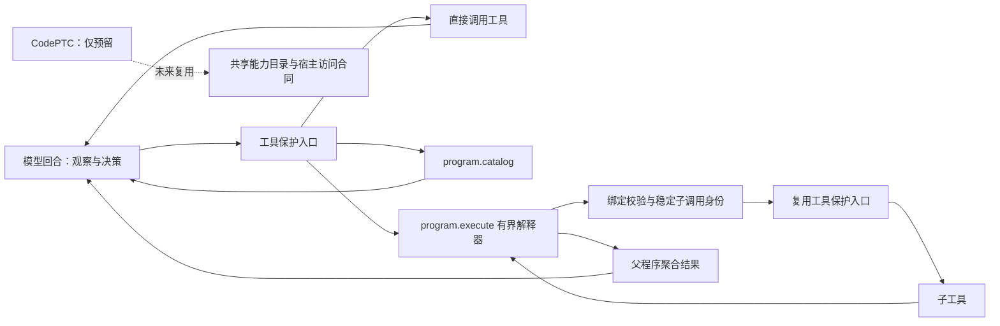

# 程序化工具调用与执行选择

本轮受限 PTC 与共享能力接口已实现，并完成约定范围的离线、SQL 与恢复验收；详见[验收记录](verification/2026-09-09-programmatic-execution.md)。CodePTC 的通用代码运行器明确延后；其预留边界见 [CodePTC 接入合同](codeptc-extension.md)。

后续真实模型调用及发现的协议兼容修复见[真实模型验收](verification/2026-09-09-programmatic-live-models.md)。自主策略选择与指定 PTC 执行分别记录，不能以执行成功替代自动选路质量。

## 执行选择

ReAct 风格的模型循环继续负责观察结果和决定下一步。PTC 是该循环中的一种动作：模型调用 `program.execute`，在一次受保护的工具调用内执行有界程序。程序可调用工具、处理结果、循环和分支，完成后将最终值交回模型。模型可以在后续回合重新选择直接工具调用或程序调用。

这种选择复用现有模型 admission、usage、attempt/outcome 和工具日志。服务解析执行器时不会另发一条没有纳入这些证据的分类模型请求。默认顶层执行器仍为 `sequential@1`；Workflow、Subagent 和 Graph 是另外的任务组织维度，不能仅因名称存在就宣称能自动组合或安全恢复。

简单动作通常直接调用工具。已能表达为确定性循环、筛选、条件或数据变换的多步任务适合程序调用。需要模型阅读新证据才能判断的步骤应回到模型循环。没有外部模型对照评测时，测试只能证明路径、结果和调用次数，不能证明模型选路质量或全局最优。

## 共享能力规范

能力通过 `CapabilityManifest.Metadata["harness.programmatic.exposure"] = "1"` 显式允许程序化目录投影。此标记不授予权限。宿主必须先应用当前 Profile、Principal 权限和 CapabilityFilter，再投影本次运行可见的冻结快照。

`pkg/app/programmatic` 的公开描述包含工具名称、说明、参数 Schema、能力版本、输出 Schema、输出上限和 BindingDigest。它不返回完整 Manifest、执行配置、凭据、来源作用域或 Provider。BindingDigest 对宿主提供的快照能力记录求摘要，覆盖能力合同、Source 和 ProviderRevision；因此同名同版本不意味着绑定未变。

`program.catalog` 用于发现可调用能力及其绑定摘要，并按需返回完整语法；常驻工具说明不重复携带全文。`program.execute` 提交的绑定集合须精确覆盖程序内所有字面量工具目标，不能用变量构造任意工具名。执行前按当前快照核对每一条绑定。程序入口和目录入口不应暴露为程序内部目标，避免递归进入执行器。

模型供应商可能限制工具名称字符。例如 OpenAI 协议边界会将带点的内部名称编码为合法 wire 名，并在模型返回调用后还原。目录中的内部名称、程序源码中的工具目标和 `bindings` 键不作替换；程序应使用目录返回的内部 ID，不能把供应商的 wire 别名写进程序。

未来 CodePTC 可以复用这套目录和绑定合同，但仍须提供独立的运行器适配、隔离和恢复证明。设置此标记不会启用 `codeptc@1`。

## 受保护调用

程序不能提供 Principal、Scope、Session、Run 或工具调用身份。包含工具目标的父模型 CallID 最长 191 字节，为子调用的 `/` 和 64 位摘要保留空间；超限在任何子效果前返回 `program_invocation_invalid`，此处比 Core 的通用 CallID 上限更严格。可信桥首先验证父调用已经通过框架保护入口，然后仅通过注入的 `Context.Invoker` 调用子工具，复用参数校验、授权、预算、审批和日志。

子调用 ID 保留父调用前缀，并对程序摘要、动态调用序号、目标能力及绑定摘要和参数求哈希。同一程序恢复时，相同调用可找到已有结果；参数或能力绑定变更不能错误命中旧结果。禁止直接持有 Provider 或调用未经过保护链路的 Snapshot 执行入口。

工具返回值以 `{ok, content, data}` 供程序使用：原始文本保留在 content；只有完整 JSON 才解析成 data，普通文本或非完整 JSON 的 data 为 null，不会解释 JSON 前缀。完整 JSON 中的重复键、深度/节点/容器超限会拒绝；声明 OutputSchema 的工具结果还必须通过该 Schema。桥接到 Core 的大整数参数不能静默变成浮点近似值，超过精确范围的标识应使用字符串。

为供模型编程的工具提供准确的 `OutputSchema`，使模型在第一次执行前能够区分数组、对象和字段类型。目录中的输出 Schema 描述工具的 JSON 输出，即上述包装中的 `data`，不是 `{ok, content, data}` 包装本身。缺少合同不会自动禁止调用，但模型不能据此可靠推断返回形状；这需要通过真实生成程序验收，而不只是编译成功来确认。`program_invalid` 的固定 `metadata.diagnostic` 对编译失败使用有限的 `compile_*` 阶段类别（源、JSON、顶层、版本、body、语句或表达式形状/未知操作、资源限制），对运行时使用 `runtime_*` 类别（如取值、索引、循环）；类别不包含原始数据、字段值或路径。任何失败都不能作为先前子工具尚未产生效果的证明。

审批暂停、取消、未知结果和工具失败会终止本次程序执行。程序语言没有异常捕获结构，不能把拒绝或未知结果转成普通值后继续产生副作用。

## 程序边界

`pkg/execution/programmatic` 实现版本化 JSON 指令集 `ptc-ir/v1`，提供赋值、工具调用、列表循环、条件、返回、列表和对象构造、字段/索引访问、比较及受检查的整数运算。完整语法由该包 `LanguageGuide` 和包文档定义。

表达式需要带 `op` 的表达式对象；`literal.value` 仅接受 scalar。数组使用 `list/items`，对象使用 `map/entries`，成员继续是表达式，不能直接把普通 JSON 数组或对象填进 scalar literal。模型可见目录通过 catalog/execute 的 `v6-container-expression-guidance` revision 提供该澄清，指令集仍为 `ptc-ir/v1`。

它不提供任意 Go、JavaScript 或 Python 执行，也没有文件、网络、进程、时间、随机数、导入、递归函数或并行执行能力。所有外部效果都必须经过宿主 Caller 和受保护桥。代码工作区、通用脚本与进程隔离属于后续 CodePTC。

程序大小、语法深度、节点数、步骤、循环、工具调用次数、容器元素、字符串和累计值分配均有上限。分配计数是解释器归属值的预算，不是操作系统级进程内存上限；外部工具的资源控制仍由工具宿主承担。超限和取消均停止执行。

## 上下文与恢复证据

参考服务默认注入 ToolJournal 和 ContextAssembler；嵌入宿主也必须提供受保护 journal，并使用支持嵌套结果配对的上下文组装器。程序入口的说明仍计入现有上下文预算。完整父程序结果已经落入模型历史时，嵌套工具结果不再重复进入模型上下文或提取式摘要。缺少合法配对证据的孤立嵌套结果必须拒绝，不能为了压缩上下文伪造成功结果。

整个程序不是跨工具事务。早期工具可能已经产生副作用，后续步骤仍可能失败。确定性重建与完成子调用复用不等于支持任意崩溃点重放；父调用未完成、工具结果未知或模型 outcome 未知时，继续遵守已有 fail-closed 边界。不能借 PTC 扩大现有 Native completed-tool-result 恢复窗口，也不能声称程序拥有持久检查点。

完整验收项和证据状态见 [执行与编排验收台账](superpowers/specs/2026-09-08-agent-execution-orchestration.md)。
