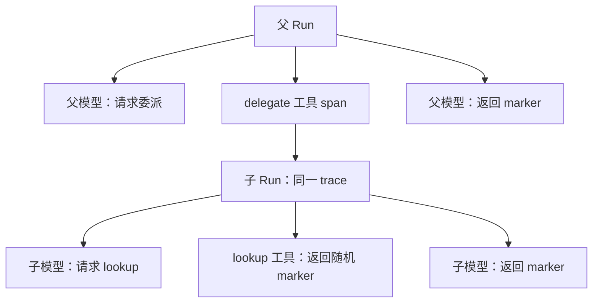

# 2026-09-06 串行真实模型与审计验收

## 结果与证据口径

**当前 LLM 端点和 Key 可用，`gemini-3.8-flash` 实际完成了下表八类场景。** 这不是只检查源码，也不是用 Mock 结果冒充模型回答。模型请求发送到用户现有兼容端点；Session、Run、Memory、RAG、Approval、Journal、Delegation 使用本机真实 PostgreSQL。业务工具使用可计数、可核对的合成数据。

验证过程中发现两处真实上下文集成问题，修复后继续串行测试。失败过程保留在后文。初始源码基线为 `5beed15`，初版模块文档为 `af3a99f`；本记录对应随后提交的修复和验收代码。

本轮共 **29 次真实模型请求**，上游均完成；其中 5 次属于最终未通过的场景执行。上游返回成功不等于 Agent 业务通过。累计上游报告 **4,742 input tokens / 4,277 output tokens**；这是 usage 记录，不是账单或费用估算。

- 任一时刻最多 **1 次 LLM Stream**，无并发模型压测。
- 新套件整个 Stream 持有互斥锁，两次请求之间至少等待 1 秒；单次套件最多 24 次请求，单 Run 最多 6 步。
- 不安装 `RetryLlmAdapter`，**自动重试 0**。每次用例失败停止后续用例，先看日志/数据库证据并做离线复现，再以子用例过滤器继续。
- 另行执行的旧审批验收也只有 2 次顺序请求，未启动后台 worker；它未使用新套件的 1 秒间隔包装器。
- Key 读取自用户授权的仓库外 `.env`；文档和证据中不保存 Key、端点地址或模型 continuation 原文。

## 场景结果

表内耗时为单次用例墙钟时间，包括 HTTP、数据库、人工限速等待和模型耗时。样本量不足以报告 p95、QPS、稳定成功率或跨框架性能排名。旧微基准仍属于原源码基线，不能直接代替修复后端到端性能。

| 场景 | 最终通过样本 | 真实请求数 | input / output tokens | 实际断言 |
| --- | ---: | ---: | ---: | --- |
| 审批暂停与替换实例恢复 | 5.05 秒 | 2 | 278 / 228 | 同 Run 恢复；工具副作用 1 次；终态事件 1 次 |
| 多轮会话恢复 | 8.39 秒 | 2 | 160 / 581 | 首轮写入随机 marker；关闭服务与连接后，同 Session 能回答旧 marker |
| Memory 跨 Session | 10.62 秒 | 4 | 941 / 431 | remember 写 SQL；重建后新 Session 用 recall 读到未提供给新会话的随机值 |
| RAG 租户过滤 | 4.95 秒 | 2 | 459 / 264 | 模型执行真实 SQL 关键词检索；回答本租户随机值；工具结果与回答不含另一租户值 |
| 受保护 Workflow | 8.23 秒 | 2 | 233 / 171 | 模型调用 pipeline；内部 double、plus 各执行一次；7→14→17；最终回答 17 |
| 持久子 Agent，含新增审计 | 11.88 秒 | 4 | 707 / 761 | 子工具生成随机值；父 Agent 返回；SQL 父子关联与 OTel 父子 span 一致 |
| 工具 Hook 拒绝 | 6.23 秒 | 2 | 200 / 193 | 工具调用被拒绝，工具副作用为 0；模型最终回答 BLOCKED |
| trace / 历史 / 重建后读取 | 5.77 秒 | 2 | 233 / 240 | Workflow 的 17 个事件、2 个模型 span、3 个执行 span；HTTP 分页等于 SQL；重建后历史不变 |

表内为各场景最终通过样本，不等于 29 次总调用。总调用还包括 Memory 首次失败 1 次、Workflow 两次失败各 2 次、补充审计标准前已经通过的子 Agent 样本 4 次。没有为凑“全绿单次执行”重新跑已经完成的所有场景；当前通过结果来自连续几次有边界的串行执行。

审批旧夹具没有安装默认 ContextAssembler；新串行夹具安装了默认 Assembler、RecentTurnsCompactor 和流式 chunk 持久化，但没有安装 RollingSummarizer。因此旧审批通过不能代替默认工具上下文验收，短会话通过也不能代替长上下文摘要验收。

## 把 trace 和聊天历史纳入验收标准

新增标准实现在 [server_live_serial_audit_test.go](../../pkg/server/server_live_serial_audit_test.go)，由每个新套件 Run 自动执行。不能只凭最终一句回答、一个 HTTP 200 或一个 completed 状态判为通过。

1. **业务结果**：核对随机 marker、计算值、工具效果次数与预期拒绝，避免模型凭提示复述答案就被判通过。
2. **聊天历史来源**：读取 `GET /v1/sessions/{id}` 和 `GET /v1/sessions/{id}/events`；每页限制 3 个事件，从 `after_seq=-1` 开始，核对 seq 连续、无重复、游标前进、version 一致。
3. **持久事实一致性**：HTTP 返回的事件逐项等于 SQL Session 事件；核对用户消息、assistant 消息、每个工具调用与结果的 call ID，以及唯一 `run/end`。历史 API 也是 Console 重建聊天和事件时间线的数据基础。
4. **真实 OTel span**：安装项目 OTel adapter 和 OpenTelemetry SDK 同步本地 exporter；核对 `run.id`、`session.id`、model span 数量与步骤数、model span 的父级 Run，以及成功工具结果对应的执行 span。
5. **嵌套编排**：Workflow 内部步骤的执行 span 挂在同一 trace 的父 span 下；子 Agent 的 Run span 必须挂在父 Agent 的 delegate 工具 span 下，并与 SQL delegation link 指向相同的父子 Run。
6. **恢复可审核性**：关闭 HTTP 服务与数据库连接池，创建替换实例后再次分页读历史；事件必须完全相同，读取过程额外 LLM 请求数为 0。
7. **失败证据保留**：在业务断言前导出当前事件和 span；测试 SQL schema 可以清理，但脱敏本地记录必须能回看。后续诊断先读这些记录，再决定是否需要新的真实调用。

这套标准在本轮的 **子 Agent 和 Workflow 历史恢复** 两个真实场景执行并通过；其余早期场景有 SQL 事件/业务断言和测试日志，但没有后来新增的完整 OTel 导出，不能倒推其已满足新增标准。Memory、Workflow、子 Agent 另有不消耗模型额度的 HTTP/SQL 审计回归。

OTel span 本次保存在本地导出文件，**不是从现有远端 trace 平台取回**；metrics provider 使用 noop。本轮未连接 OTLP Collector、Grafana/Tempo/Jaeger，也未在浏览器中操作 Console。HTTP 历史恢复与真实 SSE 客户端断线重连是不同验收项，本轮没有覆盖后者。

### 可直接审核的真实样本

以下文件保留合成聊天内容、事件、span 属性及父子 ID，continuation 已脱敏。它们来自真实模型执行；离线替身记录另放在忽略目录，未混入这些样本。

| 记录 | Session | Run | 事件 / span |
| --- | --- | --- | ---: |
| [父 Agent](evidence/2026-09-06-serial-live/run_5270f0d135592d11e095f82ec1085ab2.json) | `sess_b676680ddf76c489c19c9f2a052d7f68` | `run_5270f0d135592d11e095f82ec1085ab2` | 14 / 5 |
| [子 Agent](evidence/2026-09-06-serial-live/run_70e844cd355337feecfee7c757ae704e.json) | `sess_70e844cd355337feecfee7c757ae704e` | `run_70e844cd355337feecfee7c757ae704e` | 15 / 4 |
| [Workflow 与历史恢复](evidence/2026-09-06-serial-live/run_b7a5a0b4e968f1f8ac19a05838a9fcb6.json) | `sess_4342e62d20ed969e37dc42d8b2a4bc26` | `run_b7a5a0b4e968f1f8ac19a05838a9fcb6` | 17 / 7 |

父子 trace ID 均为 `1d715cc9261954707f287b821c5695b1`；父 delegate span ID 为 `1909506d6ae2b023`，子 Run 的 `parent_id` 正好是该 ID。Workflow trace ID 为 `0857ee33d51c2683ab600038300856d3`。父记录另含 queue claim span，因此 span 总数不等于“Run + Model + Tool”三类的简单和。



这张图表达 trace 父子关系，不是并发图；六次模型调用的审计批次中峰值在途数仍为 1。

## 失败记录与修复

### F1：Memory 已写入，但下一步上下文被拒绝

首次 Memory 用例的第一个真实模型请求成功，工具实际写入 SQL，随后 Run 失败。离线相同 HTTP/SQL/Assembler 夹具稳定复现：

```text
tool/call   memory.remember
tool/result ok=true, remembered=mem_...
step/error  model_context_failed
            model context assembly failed: invalid context assembly
run/error   model_context_failed
```

原因：Session 为兼容旧消费者，同一 assistant 消息可能同时包含 `ToolCall` 和 `ToolCalls`；前者是后者首项的别名。低层严格上下文合同将二者同时出现一律视为非法。旧审批真实测试未安装默认 Assembler，未暴露这个集成问题。

修复在 [assembler.go](../../pkg/app/contextassembly/assembler.go)：适配入口比较完整调用内容，包括 ID、name、args、continuation；一致时去掉当前私有消息中的别名，冲突时继续拒绝。保留原 Session 事件和 opaque continuation。回归覆盖别名一致、四类字段冲突及输入投影不被修改。

修复后 Memory 真实 write→重建→新 Session recall 通过，4 次请求，10.62 秒。不是更换 Key，也没有用固定字符串替代模型。

### F2：Workflow 审计中的内部结果混入模型上下文

Workflow 两次真实执行均得到最终回答 `14`，预期为 `17`。第一次失败日志缺少工具明细，只能确认回答不符，不能凭这条记录确定是哪一步的问题。随后先做离线测试，并把内部步骤设为不向模型展示，只展示 pipeline；这项夹具配置调整仍未使第二次真实执行通过。

第二次保存的明细证实模型选择了正确的 pipeline，工具全部成功：

```text
model -> serial.pipeline(n=7)
  serial.double(n=7)  -> 14
  serial.plus(n=14)   -> 17
pipeline result      -> 17
model final answer   -> 14  [FAIL]
```

检查消息投影发现，内部 `parentID/double`、`parentID/plus` 的 `tool/result` 也发给了模型，但模型的 assistant/tool-call 只请求了外层 pipeline。这产生了没有对应模型请求的内部工具响应。最初的离线替身只看最后一条外层结果，因此没有发现额外消息；加强为检查整段模型消息序列后稳定复现该缺陷。

修复在 Assembler 适配入口：只对已知模型父调用下的 `parentID/step` 内部结果做排除，并要求父调用的最终结果存在；显式被模型请求的带 `/` ID 保留，父结果缺失则报错。**SQL 审计事件、HTTP 聊天历史和工具 trace 保留全部内部步骤**，改变的只是发给模型的临时上下文。

修复后，未更改模型提示，真实最终回答为 `17`；随后加上 OTel 和 HTTP 历史审核再通过一次。上游如何处理原先不匹配的消息无法直接观测，因此不能断言其内部具体选取了哪条结果；可以确认本地消息序列原先有缺陷、修复后这两份真实样本均通过。

这次修复不提供任意损坏历史的自动恢复，也没有补齐最终工具 Schema 的 token 预算。原来的 WASM 资源治理和 E2B 未实现等边界也不因本次通过而消失。

## 执行记录索引

本机完整输出位于仓库忽略目录 `.tmp-agent-serial-20260906/`。公开仓库提交的是上面的脱敏审计样本和本报告；PostgreSQL 测试 schema 在各用例结束后清理。

| 文件 | 真实请求数 | 结果与用途 |
| --- | ---: | --- |
| `01-approval-current-key.jsonl` | 2 | 旧真实审批恢复通过 |
| `02-module-suite-first.jsonl` | 3 | 会话恢复通过；Memory 首次失败 |
| `04-memory-offline-diagnostic.log` | 0 | Memory 工具已成功、Assembler 拒绝的离线证据 |
| `05-memory-offline-fixed.log` | 0 | Memory 修复后离线通过 |
| `07-module-suite-fixed.jsonl` | 8 | Memory、RAG 通过；Workflow 首次失败 |
| `08-workflow-offline.log` / `09-workflow-offline-exposure.log` | 0 | 早期离线只核对最后结果，未覆盖完整模型消息序列 |
| `10-module-suite-remaining.jsonl` | 2 | Workflow 再次失败；保存完整内部工具明细 |
| `11-workflow-orphan-reproduction.log` | 0 | 加强消息序列断言后稳定复现 |
| `12-offline-context-fixed.log` | 0 | 两处修复后的 HTTP/SQL 离线回归通过 |
| `13-module-suite-context-fixed.jsonl` | 8 | Workflow、子 Agent、Hook 拒绝通过 |
| `14-offline-audit-standard.log` / `15-offline-parent-trace.log` | 0 | HTTP 历史、OTel 关联、重建与父子审核标准通过 |
| `16-live-trace-history.jsonl` | 6 | 子 Agent 与 Workflow 按新增审计标准真实通过 |
| `audit-live/*.json` | 0 | 3 份真实事件/span 导出；读取和复制不消耗模型请求 |
| `17-regression-all.log` | 0 | 全仓串行 Go 测试，真实 PostgreSQL；live flags 关闭 |

前置 PostgreSQL 角色不匹配、一次测试命令参数书写错误均在任何模型调用之前失败，不计入上述 29 次。诊断中也修正过测试自身过强的深拷贝断言：生产 Runtime 会隔离输入/输出，Assembler 的轻量路径不承诺供外部任意修改的深层 map；没有为满足错误断言扩大生产改动。

## 复跑方法与环境边界

测试入口为 [server_live_serial_test.go](../../pkg/server/server_live_serial_test.go)。准备隔离 PostgreSQL 并安全注入以下环境变量，值不要写进公开脚本或命令历史：

- `HARNESS_TEST_PG_DSN`：独立测试数据库；每个用例创建并清理独立 schema。
- `HARNESS_LLM_BASE_URL`、`HARNESS_LLM_API_KEY`：当前兼容端点和 Key。
- `HARNESS_LLM_MODEL=gemini-3.8-flash`、`HARNESS_LLM_MAX_TOKENS=2048`。
- `HARNESS_ACCEPTANCE_LIVE_SERIAL=1`：显式允许真实串行套件。
- `HARNESS_ACCEPTANCE_EVIDENCE_DIR`：仓库忽略目录中的绝对路径，持久导出审计 JSON。

Windows 本轮使用 Go 1.25.13、PostgreSQL 17.6，`GOCACHE`、`GOTMPDIR` 和测试 TEMP 均放 D 盘。本轮数据库只监听 loopback，角色 `harness_serial`；使用真实数据库进程，不使用 SQL Mock。

```powershell
# 有真实模型费用：完整串行套件，默认不启用。
go test -p 1 -parallel 1 -json -count=1 -timeout=900s ./pkg/server `
  -run '^TestLiveModelSerialModuleAcceptance$'

# 某场景失败后先查持久证据，只运行尚未完成或新增标准的场景。
go test -p 1 -parallel 1 -json -count=1 -timeout=900s ./pkg/server `
  -run '^TestLiveModelSerialModuleAcceptance$/(durable_subagent|trace_history_restore)$'

# 不调用外部模型：相同 HTTP / PostgreSQL / Context / OTel 链路的离线回归。
go test -p 1 -parallel 1 -count=1 -timeout=120s ./pkg/server `
  -run '^TestPostgresSerial(Memory|Workflow)Fixture$|^TestPostgresSerial(AuditHistoryRestore|SubagentAudit)$'
```

旧审批验收另需 `HARNESS_ACCEPTANCE_LIVE_MODEL=1`，用精确过滤器 `^TestLiveModelHTTPApprovalResumesOnReplacementInstance$` 单独串行执行；不要同时运行两个 live 测试进程。新套件互斥锁约束的是本进程的模型请求，不是整个账号的分布式并发限额。

这是一组真实上游模型 + HTTP 测试服务 + PostgreSQL 的集成验收。Authenticator 返回固定测试 Principal，实例替换发生在同一 Go 测试进程内；没有实际 kill 生产进程、操作真实账号、启动完整 `cmd/server` 产品部署或执行浏览器端 E2E。Sandbox、MCP、Runner、Graph、Artifact、长上下文摘要等未覆盖项，在[逐模块覆盖表](../agent-module-assessment.md)中明确列为未验收。

## 本轮回归

`go test -p 1 -parallel 1 -count=1 -timeout=600s ./...` 已通过，启用隔离 PostgreSQL、关闭所有真实模型开关。核心循环、上下文别名/嵌套结果回归，以及 HTTP/SQL Memory、Workflow、父子 trace 审核均通过。

最终补充了“旧 Run 的同名 call ID 结果不得替代当前 Workflow 父结果”的拒绝断言，随后相关核心/上下文/HTTP/SQL 回归再次通过。受影响范围的 race 检查也通过：`go test -race -p 1 -parallel 1 -count=1 -timeout=180s ./pkg/app/contextassembly ./pkg/core ./pkg/server -run 'Assembler|ModelContext|PostgresSerial'`。这不是全仓 race 声明。

格式、`go build -p 1 ./...`、`go vet -p 1 ./...`、staticcheck v0.7.0 均通过。OpenAPI 校验通过（102 个注册 `/v1` 操作），本报告/架构/模块评估的本地文件链接和 44 行模块覆盖表已核对。未重新执行漏洞扫描、容器验收或 Windows Sandbox 原生验收。
